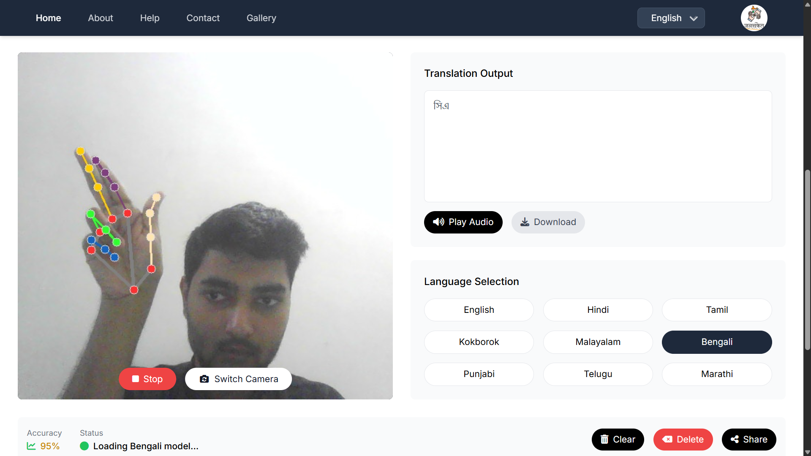

# 🙌 JanSanket – Indian Regional Sign Language Translator 🇮🇳

JanSanket is a real-time Indian Sign Language (ISL) interpretation platform that converts **static ISL alphabet gestures** into **multilingual text and speech output** across **9 Indian languages**.

Built with accessibility, inclusion, and scalability in mind, JanSanket aims to bridge communication gaps for the deaf and mute communities—especially in rural and tribal areas where internet access is limited and regional language support is scarce.

---

## 🎯 Problem Statement

India is home to **7+ million deaf or hard-of-hearing individuals**, many of whom rely on ISL. Yet:
- Most tools support only **ASL (American Sign Language)**.
- **No public platform supports Indian regional or tribal sign languages.**

JanSanket fills this critical void with an **real-time**, and **regionally inclusive** solution.

---

## 💡 Features

- 🖐️ Detects **A-Z static ISL gestures** using webcam.
- 🌐 Converts signs to **text** and **audio** in:
  - Hindi, English, Bengali, Tamil, Telugu, Malayalam, Marathi, Punjabi, Kokborok
- 🔊 Text-to-speech support via Hugging Face models.
- 💻 Lightweight and deployable on desktops or mobile devices.

---

## 🛠️ Tech Stack

### 👁️‍🗨️ Computer Vision
- [MediaPipe](https://google.github.io/mediapipe/) – Real-time hand tracking (21-point hand landmarks)
- OpenCV – Webcam integration and frame capture

### 🧠 Machine Learning
- CNN (Convolutional Neural Network) trained on Indian Sign Language datasets
- TensorFlow + Keras for model training
- TensorFlow Lite (TFLite) for edge deployment

### 🗣️ Natural Language & TTS
- Hugging Face 🤗 Transformers
  - IndicTTS & Wav2Vec for speech synthesis in Indian languages

### 🌐 Web Interface
- HTML, TailwindCSS, JavaScript – Frontend UI
- Python Flask – Backend server and REST APIs

### 📦 Tools & Frameworks
- Google Colab – Model training
- GitHub Projects – Agile planning & version control
- Figma – UI mockups
- VSCode – Development

---

## 🧪 System Architecture

1. **Input**: Hand gesture via webcam
2. **Preprocessing**: Landmark extraction (MediaPipe)
3. **Classification**: CNN model infers gesture
4. **Translation**: Lookup maps gesture → text in selected language
5. **Output**: Text displayed & spoken via TTS (offline)

---

## 📷 Sample Interface

| Live Webcam Input | Translated Output |
|-------------------|--------------------|
|  | 

---

## 🔄 Future Roadmap

✅ Current:
- Static gesture recognition (A–Z)
- Text/audio output in 9 Indian languages

🚀 Planned:
- Dynamic gesture recognition (words/phrases)
- Reverse conversion (Text/Speech → Sign)
- Android app using Flutter + TFLite
- Browser plugin / extension for **online meeting compatibility**
- School/NGO deployment in partnership with accessibility orgs
- Expanded dataset for regional signs (tribal/state-specific gestures)

---

## 🧑‍🤝‍🧑 Team

A proud collaboration by 2nd-year CSE students from Bennett University:

- Harshit Gupta
- Devraj Singh Bhadoria
- Vaibhavi Rawat

### Special Thanks 🙏  
To our incredible mentor **Dr. Sanchali Das**, whose support and guidance empowered us to think inclusively and build meaningfully.

---

## 📄 Documentation

- 📘 [Final Report PDF](Jansanket_Report.pdf)
- 🎞️ [PPT Presentation](Jansanket.pptx)
> 🔒 *Core code/model files kept private for academic integrity.*

---

## 📢 License

This repository is part of an academic capstone project and intended for educational/non-commercial use.

---

## 🤝 Get Involved

Want to contribute or partner for real-world deployment?
Open an issue or drop us a message.

Let’s make communication accessible — one sign at a time! 🧏‍♂️📲

---

### Tags:
`#SignLanguage` `#ISL` `#India` `#Accessibility` `#EdgeAI` `#DeepLearning` `#HuggingFace` `#TFLite` `#BennettUniversity` `#JanSanket` `#TechForGood`
